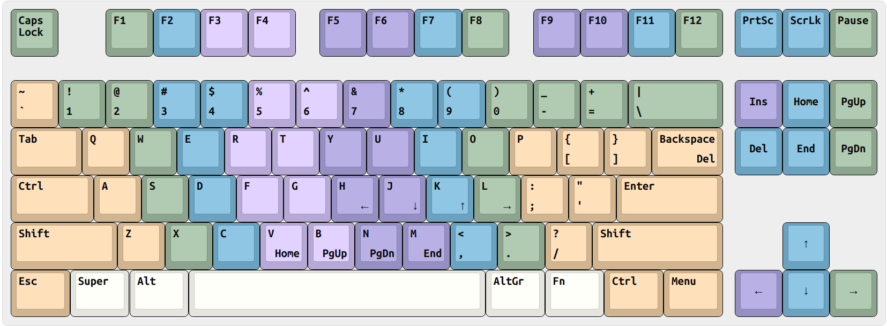
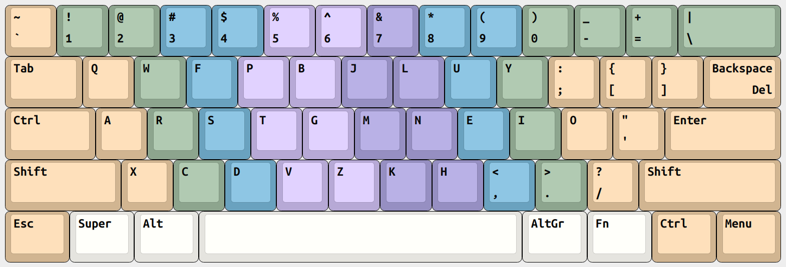

# xkb-layouts

Linux [XKB](https://en.wikipedia.org/wiki/X_keyboard_extension) files
for custom ANSI and Colemak-DH ANSI layouts

## Installation

### Wayland

As far as I know, when using Wayland one can just copy `rules/`, `symbols/`
and `types/` into `~/.config/xkb/` directory and it should work

```sh
$ mkdir -p ~/.config/xkb
$
$ cd xkb-layouts/
$ cp -r rules symbols types  ~/.config/xkb/
$
$ tree ~/.config/xkb/

/home/user/.config/xkb/
├── rules
│   ├── evdev
│   └── evdev.xml
├── symbols
│   ├── colemak_dh_ansi
│   ├── custom_ansi
│   ├── custom_colemak_dh_ansi
│   ├── custom_movement
│   └── custom_rearrange
└── types
    └── custom_three_level

3 directories, 8 files
```

Then log out and log in for keyboard layouts to be loaded and choose a layout
from your system's "Keyboard Settings > Layouts"

### X11

Adding files to `~/.config/xkb/` doesn't seem to work properly in X11, so we
need to directly edit files from `/usr/share/X11/xkb/` for changes to take place

NOTE: It requires `sudo` to edit files from `/usr/share/X11/xkb/` and your
changes can occasionally be overwritten by system updates

First, copy `symbols/` and `types/` to their respective directories in
`/usr/share/X11/xkb/`

```sh
$ cd xkb-layouts/
$ sudo cp -r symbols types  /usr/share/X11/xkb/
```

Then we need to manually edit `rules/evdev.lst` and `rules/evdev.xml` from
`/usr/share/X11/xkb/` to add our custom layouts

```sh
# xed, vim or any other text editor
sudo xed /usr/share/X11/xkb/rules/evdev.lst
```

Find the `! layout` section in the file and add the following

```
  colemak_dh_ansi        Colemak-DH ANSI
  custom_ansi            (Custom) ANSI
  custom_colemak_dh_ansi (Custom) Colemak-DH ANSI
```

```sh
sudo xed /usr/share/X11/xkb/rules/evdev.xml
```

Find the `<layoutList>` section in the file and add the following

```xml
    <layout>
      <configItem>
        <name>colemak_dh_ansi</name>
        <shortDescription>CMK</shortDescription>
        <description>Colemak-DH ANSI</description>
      </configItem>
    </layout>
    <layout>
      <configItem>
        <name>custom_ansi</name>
        <shortDescription>XA</shortDescription>
        <description>(Custom) ANSI</description>
      </configItem>
    </layout>
    <layout>
      <configItem>
        <name>custom_colemak_dh_ansi</name>
        <shortDescription>XCA</shortDescription>
        <description>(Custom) Colemak-DH ANSI</description>
      </configItem>
    </layout>
```

Finally, we need to manually edit `types/complete` from `/usr/share/X11/xkb/` to
include our custom type

```sh
sudo xed /usr/share/X11/xkb/types/complete
```

Add the following

```
    include "custom_three_level"
```

Then log out and log in for keyboard layouts to be loaded and choose a layout
from your system's "Keyboard Settings > Layouts"

## Important Notes

In case you have added more than one keyboard layout in "Keyboard Settings > Layouts",
your system can automatically enable the "Switching to another layout" shortcut
in "Keyboard Settings > Layouts > Options"

That can cause your <kbd>CapsLock</kbd> not to function as <kbd>Ctrl</kbd> as
defined by [`symbols/custom_rearrange`](symbols/custom_rearrange). In order to
fix that, disable or change the "Switching to another layout" shortcut

Also, the order you list your keyboard layouts preference affects the way
key symbols are combined into groups, so keep your custom layouts at the top.

## Symbols for "(Custom) ANSI"

See [`symbols/custom_ansi`](symbols/custom_ansi)



## Symbols for "(Custom) Colemak-DH ANSI"

See [`symbols/custom_colemak_dh_ansi`](symbols/custom_colemak_dh_ansi)



## Some useful commands

To see the resulting keyboard layout run `xkbcomp -xkb $DISPLAY -` and to print
info about a specific layout run `setxkbmap -layout  layout-name-here  -print`

## References

- https://who-t.blogspot.com/2020/02/user-specific-xkb-configuration-part-1.html
- https://who-t.blogspot.com/2020/07/user-specific-xkb-configuration-part-2.html
- https://who-t.blogspot.com/2020/08/user-specific-xkb-configuration-part-3.html
- https://who-t.blogspot.com/2020/09/user-specific-xkb-configuration-putting.html
- https://github.com/frgomes/hyena
- https://colemakmods.github.io/mod-dh/
