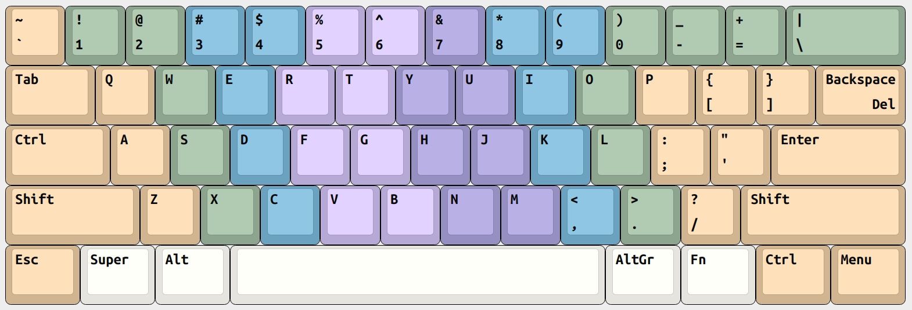

# xkb-layouts

Linux [XKB](https://en.wikipedia.org/wiki/X_keyboard_extension) files for Custom ANSI and Colemak-DH ANSI layouts

## Type CUSTOM_THREE_LEVEL

Include this new type. See [`types/custom_three_level`](types/custom_three_level)

## Symbols for Custom ANSI

See [`symbols/custom_ansi`](symbols/custom_ansi)

## Symbols for Colemak-DH ANSI

See [`symbols/colemak_dh_ansi`](symbols/colemak_dh_ansi)

